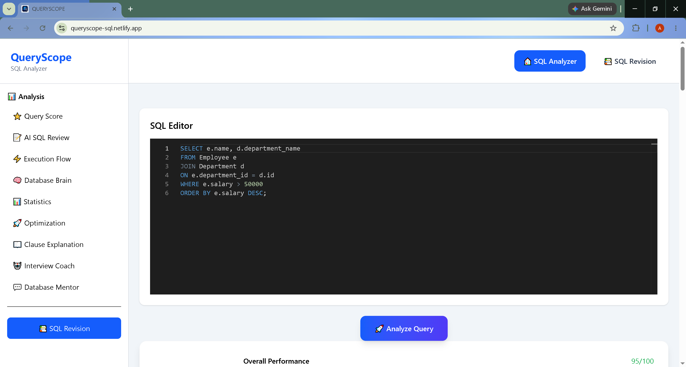
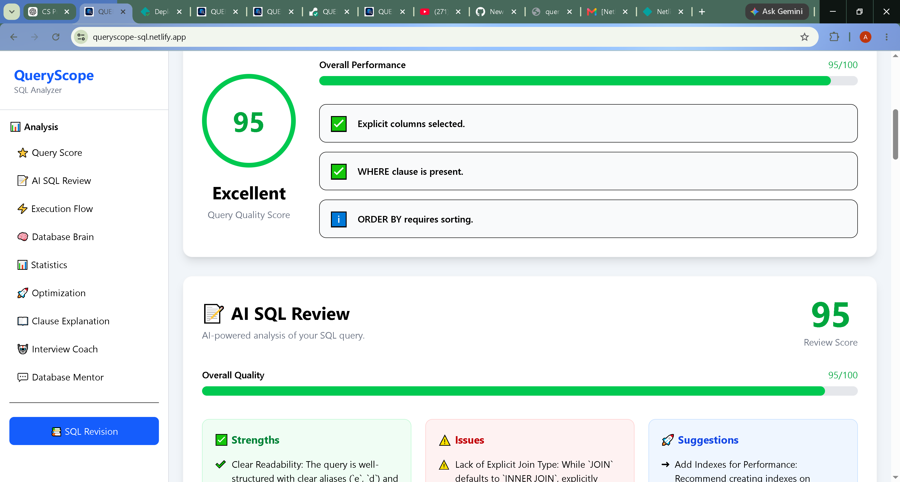
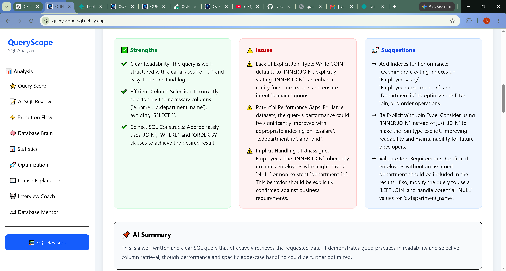
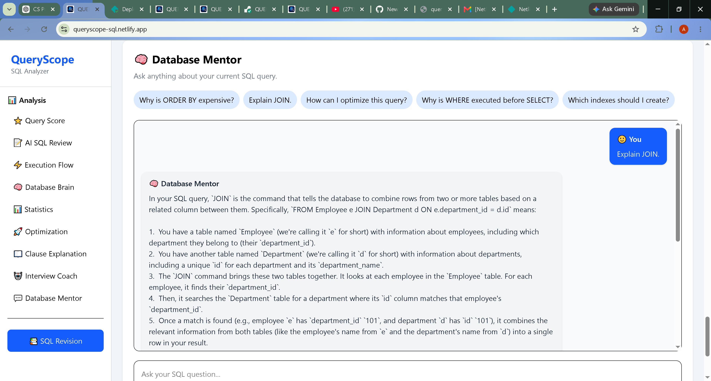
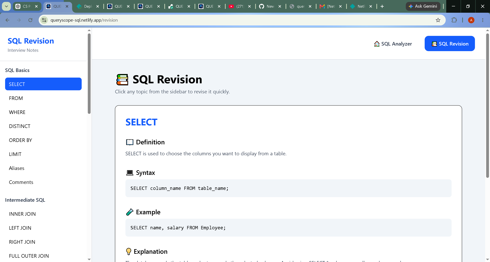

# QueryScope

QueryScope is an AI-powered SQL learning platform that helps students understand, analyze, optimize, and revise SQL queries. It combines SQL query analysis, AI-powered learning tools, and interview preparation into a single platform.

## 🌐 Live Demo

**Frontend:** https://queryscope.netlify.app

**Backend API:** https://queryscope.onrender.com

---

## ✨ Features

### SQL Query Analyzer
- Analyze SQL queries instantly.
- Visualize SQL execution order.
- Query statistics and cost estimation.
- Clause-by-clause explanation.
- Optimization suggestions.
- Query quality score.

### AI SQL Review
- Review SQL queries using AI.
- Identify strengths and weaknesses.
- Suggest improvements.
- Overall query evaluation.

### AI Interview Coach
- Generate SQL interview questions.
- Easy, Medium and Hard difficulty.
- Interview-focused preparation.

### Database Mentor
- AI-powered SQL assistant.
- Ask SQL-related questions.
- Learn concepts interactively.

### SQL Revision
- Topic-wise SQL revision.
- Simple explanations.
- Syntax and examples.
- Interview tips.
- Common mistakes.
- Quick revision notes.

---

## 🛠 Tech Stack

### Frontend
- React
- Vite
- Tailwind CSS
- Axios

### Backend
- Node.js
- Express.js

### AI
- Google Gemini API

### SQL Parser
- node-sql-parser

---

## 📸 Screenshots

### Home Page



---

### SQL Analyzer



---

### AI SQL Review



---

### Database Mentor



---

### SQL Revision



---

## 📂 Project Structure

```text
QueryScope
│
├── client
│   ├── public
│   ├── src
│   │   ├── assets
│   │   ├── components
│   │   ├── pages
│   │   └── services
│   └── package.json
│
├── server
│   ├── ai
│   ├── analyzer
│   ├── parser
│   ├── prompts
│   ├── routes
│   ├── services
│   └── package.json
│
├── screenshots
│
└── README.md
```

---

## 🚀 Installation

### Clone Repository

```bash
git clone https://github.com/Aditya202006/QUERYSCOPE.git
```

Move into the project

```bash
cd QUERYSCOPE
```

---

### Frontend

```bash
cd client
npm install
npm run dev
```

---

### Backend

Open another terminal.

```bash
cd server
npm install
npm start
```

---

## ⚙️ Environment Variables

Create a `.env` file inside the `server` folder.

```env
GEMINI_API_KEY=YOUR_GEMINI_API_KEY
```

---

## 🔮 Future Improvements

- Support more SQL dialects.
- Visual query execution.
- Query history.
- User authentication.
- Dark mode.
- SQL practice challenges.

---

## 👨‍💻 Author

**Aditya Ramana Sai Nagendra**

GitHub: https://github.com/Aditya202006

---

## 📄 License

This project is developed for learning and educational purposes.